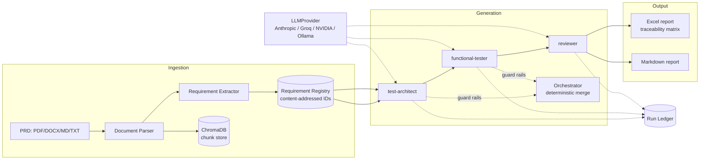

# Driftpin

Requirement-centric QA automation. Every strategy, test case, automation script, and failure report in this system traces back to a specific requirement extracted from a source product document — not a test name, not a file path, a requirement ID.

Most "AI writes tests" tools optimize for volume: generate a pile of Playwright scripts and call it coverage. Driftpin optimizes for a different question — when something breaks, which requirement is at risk, and is the rest of the surface still covered. The requirement registry is the spine everything else hangs off of.

## What it answers

- Which requirement does this failing test protect?
- Which requirements are under-tested relative to their risk tier, not their line coverage?
- The PRD changed — which tests are now stale, and which requirements lost coverage?
- Are the generated tests actually good, measured against injected mutants and a human-authored golden set — not just "they pass"?
- Did a self-heal repair a broken selector, or quietly paper over a real regression?

## Status

**Release 1 is complete.** The full pipeline — ingestion with deterministic AC parsing and NFR linking, a registry-level spec consistency pass, enumerate-then-fill generation with code-enforced requirement completeness, a three-layer review (Python structural checks, split semantic review, a dedicated fallback-rule call), and a zero-coverage safety alarm that forces `Review Passed: False` in code — has run end-to-end for real on Groq, NVIDIA NIM, and local Ollama, with ledger evidence for every run.

Every capability shipped in Release 1 was driven by a live-found failure, fixed, and re-verified live rather than assumed from unit tests: the ~67% coverage ceiling (fixed by enumerate-then-fill; 100% coverage on all three providers since), the reviewer passing suites with real contradictions (fixed by the review redesign, which then caught a genuine never-drop violation live), requirements silently receiving zero test cases (fixed by completeness enforcement plus the coverage alarm — which immediately caught a real scenario-ID collision bug the same day it shipped), and a spec-blind pipeline that checked tests against the spec but never the spec against itself (fixed by the consistency pass, scored against a 9-defect adversarial answer key: from 0/9 to 5 full + 4 partial catches, with the remaining precision work documented, not hidden). Full evidence trail in [EVALS.md](EVALS.md); reasoning behind every design decision in [DESIGN_DECISIONS.md](DESIGN_DECISIONS.md).

**Known limits carried forward, stated plainly:** the lifecycle consistency check over-flags on clean specs (high recall, low precision — needs state-reachability gating), the unlink-vs-GDPR pair shape is a documented model-capability miss, and the human precision/recall scoring against hand-written golden cases remains deliberately human-executed, not self-scored.

**Further advancement lands in the next releases:** self-healing automation scripts with healing provenance (Playwright/Selenium), mutation scoring via mutmut/Stryker, requirement triage, the `driftpin run`/`driftpin edit` CLI restructure with natural-language routing (Release 2); OpenAI provider support (Release 3); and the traceability-graph workspace UI (Release 4).

## Architecture

Python 3.11+ core, no Node dependency. Every agent output is schema-validated pydantic before any renderer touches it — the LLM never writes a binary artifact directly. Every LLM call, including failed structured-output attempts, is appended to a per-run ledger; that ledger is the only accepted evidence that something actually ran.



Key pieces:

- **Provider layer** (`providers/`) — one `LLMProvider` interface; Anthropic, Groq, NVIDIA NIM, and Ollama implemented, OpenAI planned for Release 3. A new provider is one new file.
- **Requirement registry** (`ingestion/registry.py`) — the system's central data structure. IDs are content-addressed (hash of source doc + verbatim requirement text), never assigned by the extracting LLM, so re-ingesting an unchanged PRD produces identical IDs regardless of extraction order.
- **Extraction guard rail** (`ingestion/extractor.py`) — every candidate requirement's source span is verified as a verbatim substring of the actual document after extraction. A quote that can't be found gets demoted to a flagged ambiguity, never trusted into the registry. Acceptance criteria are parsed deterministically (`ingestion/ac_parser.py`, zero LLM calls for machine-labeled PRDs) with a scoped per-requirement LLM fallback.
- **Spec consistency pass** (`consistency/`) — before any test is generated, the registry is checked against *itself*: requirement vs its own ACs, applicable NFRs, overlapping peer requirements, missing failure paths, and entity lifecycle states. Python enumerates the comparison pairs; one scoped LLM call judges each; optional self-consistency mode quarantines unstable verdicts as `flagged_for_review` instead of majority-voting them.
- **Agents as config** (`agents/*.yaml` + `prompts/*.md.j2`) — test-architect, functional-tester, reviewer, and the consistency checker are declared, not hardcoded; one generic runtime (`agents/runtime.py`) executes them all against their schema.
- **Deterministic orchestrator** (`agents/orchestrator.py`) — runs the pipeline and merges output with guard-rail code, not council mode or model debate. A scenario or test case referencing an unknown requirement gets dropped and logged to `ASSUMPTIONS.md`, never silently trusted.
- **Renderers** (`render/`) — Excel (traceability matrix as a first-class sheet) and Markdown, both stamped with generator version, run ID, registry version, and source-doc hashes.
- **CLI + REPL** (`cli/`) — one action layer (`cli/actions.py`) backs both the one-shot commands and the interactive `driftpin chat` session, so a run behaves identically either way.

## Commands

| Command | What it does |
|---|---|
| `driftpin init` | Configure the provider (Anthropic, Groq, NVIDIA NIM, or a local Ollama model) for this project. |
| `driftpin ingest --docs <path>...` | Parse documents, extract requirements, merge into the registry. |
| `driftpin chat` | Interactive session — `/ingest`, `/requirements`, `/strategy`, `/cases`, `/status`. |
| `driftpin generate strategy --out <dir>` | Generate scenarios from the registry, no cases yet. |
| `driftpin generate cases --out <dir>` | Full pipeline — Excel + Markdown reports with the traceability matrix. |

## Setup

```
pip install -e ".[dev]"
driftpin init
```

`init` walks through provider selection, validates the connection (a real API call for Anthropic/Groq/NVIDIA, a reachability + conformance probe for Ollama), and for local models runs a structured-output conformance probe before trusting it with schema-first agents.

## Docker

```
docker compose build
docker compose run --rm driftpin --help
docker compose run --rm driftpin ingest --docs samples/password_reset_prd.md --project-root /workspace
```

The repo is mounted at `/workspace`; `.driftpin/`, ingested docs, and generated artifacts all live there. An optional local Ollama service is available behind a compose profile: `docker compose --profile local-model up`.

## License

Proprietary. All rights reserved.
