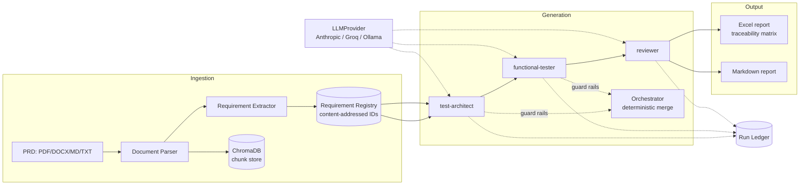

# Driftpin

Requirement-centric QA automation. Every strategy, test case, automation script, and failure report in this system traces back to a specific requirement extracted from a source product document — not a test name, not a file path, a requirement ID.

Most "AI writes tests" tools optimize for volume: generate a pile of Playwright scripts and call it coverage. Driftpin optimizes for a different question — when something breaks, which requirement is at risk, and is the rest of the surface still covered. The requirement registry is the spine everything else hangs off of.

## What it answers

- Which requirement does this failing test protect?
- Which requirements are under-tested relative to their risk tier, not their line coverage?
- The PRD changed — which tests are now stale, and which requirements lost coverage?
- Are the generated tests actually good, measured against injected mutants and a human-authored golden set — not just "they pass"?
- Did a self-heal repair a broken selector, or quietly paper over a real regression?

## Status

Release 1 is code-complete and has run for real: ingestion, generation, and rendering have all executed end-to-end against a human-authored PRD on Anthropic-compatible (Groq) and local (Ollama) providers, with ledger evidence for every run. What's still open is the actual gate itself — a human scoring the generated test cases against hand-written expected coverage (precision/recall), which is deliberately reserved for a human, not something this tool scores on its own behalf. An independent fresh-context audit also flagged a real schema gap (several output fields could pass validation while empty or templated) that's since been fixed with `min_length` constraints. See [EVALS.md](EVALS.md) for what's scored and what's still pending, and [DESIGN_DECISIONS.md](DESIGN_DECISIONS.md) for the reasoning behind the architecture below.

## Architecture

Python 3.11+ core, no Node dependency. Every agent output is schema-validated pydantic before any renderer touches it — the LLM never writes a binary artifact directly. Every LLM call, including failed structured-output attempts, is appended to a per-run ledger; that ledger is the only accepted evidence that something actually ran.



Key pieces:

- **Provider layer** (`providers/`) — one `LLMProvider` interface; Anthropic, Groq, and Ollama implemented, OpenAI planned for Release 3. A new provider is one new file.
- **Requirement registry** (`ingestion/registry.py`) — the system's central data structure. IDs are content-addressed (hash of source doc + verbatim requirement text), never assigned by the extracting LLM, so re-ingesting an unchanged PRD produces identical IDs regardless of extraction order.
- **Extraction guard rail** (`ingestion/extractor.py`) — every candidate requirement's source span is verified as a verbatim substring of the actual document after extraction. A quote that can't be found gets demoted to a flagged ambiguity, never trusted into the registry.
- **Agents as config** (`agents/*.yaml` + `prompts/*.md.j2`) — test-architect, functional-tester, and reviewer are declared, not hardcoded; one generic runtime (`agents/runtime.py`) executes all three against their schema.
- **Deterministic orchestrator** (`agents/orchestrator.py`) — runs the pipeline and merges output with guard-rail code, not council mode or model debate. A scenario or test case referencing an unknown requirement gets dropped and logged to `ASSUMPTIONS.md`, never silently trusted.
- **Renderers** (`render/`) — Excel (traceability matrix as a first-class sheet) and Markdown, both stamped with generator version, run ID, registry version, and source-doc hashes.
- **CLI + REPL** (`cli/`) — one action layer (`cli/actions.py`) backs both the one-shot commands and the interactive `driftpin chat` session, so a run behaves identically either way.

## Commands

| Command | What it does |
|---|---|
| `driftpin init` | Configure the provider (Anthropic, Groq, or a local Ollama model) for this project. |
| `driftpin ingest --docs <path>...` | Parse documents, extract requirements, merge into the registry. |
| `driftpin chat` | Interactive session — `/ingest`, `/requirements`, `/strategy`, `/cases`, `/status`. |
| `driftpin generate strategy --out <dir>` | Generate scenarios from the registry, no cases yet. |
| `driftpin generate cases --out <dir>` | Full pipeline — Excel + Markdown reports with the traceability matrix. |

## Setup

```
pip install -e ".[dev]"
driftpin init
```

`init` walks through provider selection, validates the connection (a real API call for Anthropic/Groq, a reachability + conformance probe for Ollama), and for local models runs a structured-output conformance probe before trusting it with schema-first agents.

## Docker

```
docker compose build
docker compose run --rm driftpin --help
docker compose run --rm driftpin ingest --docs samples/password_reset_prd.md --project-root /workspace
```

The repo is mounted at `/workspace`; `.driftpin/`, ingested docs, and generated artifacts all live there. An optional local Ollama service is available behind a compose profile: `docker compose --profile local-model up`.

## License

Proprietary. All rights reserved.
